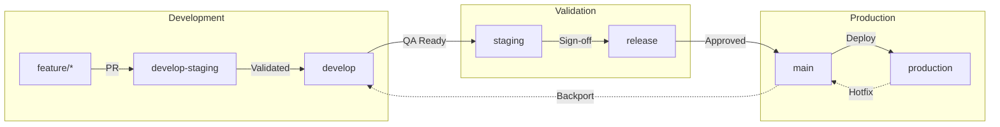
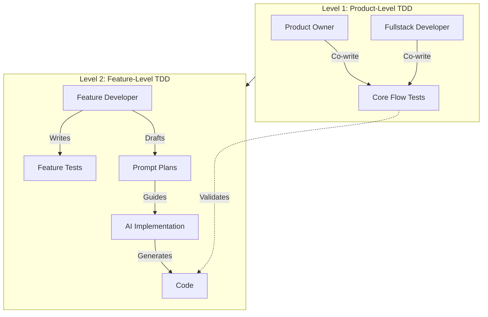

# DTMA Academy - CI/CD & Development Workflow Specification

**Version:** 1.0  
**Last Updated:** January 5, 2026  
**Status:** Active

---

## Table of Contents

1. [Overview](#1-overview)
2. [Branching Strategy](#2-branching-strategy)
3. [Test-Driven Development Strategy](#3-test-driven-development-strategy)
4. [AI-Assisted Development Workflow](#4-ai-assisted-development-workflow)
5. [Process Flow & Controls](#5-process-flow--controls)
6. [Governance Controls](#6-governance-controls)
7. [AI Integration Value Chain](#7-ai-integration-value-chain)
8. [Prompting Templates](#8-prompting-templates)

---

## 1. Overview

This document defines the CI/CD pipeline, branching strategy, and AI-assisted development workflow for DTMA Academy. It establishes the merge paths, quality gates, and prompting strategies that govern how code moves from development to production.

### Core Principles

| Principle | Description |
|:----------|:------------|
| **TDD-First** | Tests defined before implementation at product and feature levels |
| **AI-Assisted** | AI tools augment development, review, and testing at every stage |
| **Controlled Promotion** | Code progresses through validated stages with approval gates |
| **Reviewer-Led QA** | Staging environment validation is strictly reviewer-controlled |

---

## 2. Branching Strategy

### Branch Hierarchy

```
feature/* → develop-staging → develop → staging → release → main → production
```



### Branch Definitions

| Branch | Purpose | Environment | Stability | Merge Source | Merge Target |
|:-------|:--------|:------------|:----------|:-------------|:-------------|
| `feature/*` | Developer workstreams for new features or fixes | Local / CI | Low | — | develop-staging |
| `develop-staging` | Daily integration of incomplete or experimental work | Preview (Vercel) | Medium-Low | feature/* | develop |
| `develop` | Integration of validated and complete features | Dev | Medium | develop-staging | staging |
| `staging` | QA and system testing (reviewer-led) | Staging | High | develop | release |
| `release` | UAT and final verification | UAT | Very High | staging | main |
| `main` | Production-ready baseline | Production | Stable | release | production |
| `production` | Live snapshot and hotfix base | Production | Stable | main | — |

### Branch Naming Conventions

```
feature/<ticket-id>-<short-description>
bugfix/<ticket-id>-<short-description>
hotfix/<ticket-id>-<short-description>

Examples:
feature/DTMA-123-course-filtering
bugfix/DTMA-456-video-playback-fix
hotfix/DTMA-789-auth-token-refresh
```

---

## 3. Test-Driven Development Strategy

### Two-Level TDD Approach

DTMA Academy implements TDD at two distinct levels, each with different ownership and scope:



### Level 1: Product-Level TDD

**Ownership:** Product Owner + Fullstack Developer (co-authored)

**Scope:** Core user flows as defined in the PRD

**Purpose:** Ensure critical business journeys work end-to-end

| Responsibility | Product Owner | Fullstack Developer |
|:---------------|:--------------|:--------------------|
| Define acceptance criteria | ✅ | ✅ |
| Write test scenarios (Gherkin) | ✅ | — |
| Implement E2E test code | — | ✅ |
| Review test coverage | ✅ | ✅ |
| Approve test changes | ✅ | — |

**Core Flow Tests (from Test Specification):**
- Landing Page → Course Discovery → Enrollment
- Course Catalog → Filtering → Quick View
- Course Details → Curriculum → Resources
- Learning Experience → Video Playback → Quiz
- Authentication → Dashboard Access
- User Dashboard → Progress Tracking

### Level 2: Feature-Level TDD

**Ownership:** Feature Developer (individual contributor)

**Scope:** Specific feature implementation details

**Purpose:** Ensure feature components work correctly in isolation and integration

**Workflow:**
1. **Draft Prompt Plan** - Define what AI should build
2. **Write Feature Tests** - Tests before implementation
3. **Prompt AI** - Use structured prompts to generate code
4. **Validate Against Tests** - AI code must pass tests
5. **Refine** - Iterate until tests pass

```
┌─────────────────────────────────────────────────────────────┐
│  Feature Developer Workflow                                 │
├─────────────────────────────────────────────────────────────┤
│                                                             │
│  1. Receive Feature Assignment                              │
│           ↓                                                 │
│  2. Draft Prompt Plan (what to build)                       │
│           ↓                                                 │
│  3. Write Feature Tests (unit + integration)                │
│           ↓                                                 │
│  4. Prompt AI with Plan + Test Context                      │
│           ↓                                                 │
│  5. Review AI Output Against Tests                          │
│           ↓                                                 │
│  6. Iterate Until Tests Pass                                │
│           ↓                                                 │
│  7. Submit PR with Tests + Implementation                   │
│                                                             │
└─────────────────────────────────────────────────────────────┘
```

### Prompt Plan Template

Feature developers must draft prompt plans before prompting AI:

```markdown
## Prompt Plan: [Feature Name]

### Context
- Related files: [list files]
- Dependencies: [list dependencies]
- Test file: [path to test file]

### Requirements
1. [Functional requirement 1]
2. [Functional requirement 2]

### Constraints
- Must pass: [test IDs]
- Must not break: [existing features]
- Style guide: [coding standards]

### Expected Output
- New files: [list]
- Modified files: [list]
- Test coverage: [percentage]
```

---

## 4. AI-Assisted Development Workflow

### AI Tools by Phase

| Phase | Free Tools | Free Trial | Paid Tools |
|:------|:-----------|:-----------|:-----------|
| **Development** | GitHub Copilot (limited), Codeium | Codacy, DeepCode | Cursor AI, CommitAI |
| **Integration** | Snyk Basic, GitHub Actions + AI | Testim.io, BuildCopilot | Mabl, DeepSource AI |
| **Validation** | SonarQube Community, QA Wolf | TestSigma, Functionize | SonarQube Enterprise |
| **Testing** | Percy Community, Lighthouse CI | Applitools Eyes, Launchable | BrowserStack AI |
| **Release** | ChatGPT Web, LambdaTest Basic | Testim AI Feedback | ChatGPT Enterprise |
| **Production** | Grafana + OpenAI | New Relic AI | Dynatrace Davis |
| **Hotfix** | CodeQL, Dependabot AI | Moogsoft AIOps | PagerDuty AI |

### Recommended Stack for DTMA

| Function | Tool | Tier |
|:---------|:-----|:-----|
| Code Generation | Cursor AI / GitHub Copilot | Paid / Free |
| Code Review | CodeRabbit / Codacy | Free Trial |
| Security Scanning | Snyk | Free |
| Test Generation | GitHub Copilot | Free |
| Build Optimization | GitHub Actions | Free |
| Visual Regression | Percy | Free Community |
| Production Monitoring | Vercel Analytics | Free |

---

## 5. Process Flow & Controls

### Phase 1: Feature Development (`feature/*`)

**Controls:**
- ✅ Commits pass build and lint checks
- ✅ Incomplete features isolated in branch
- ✅ Optional peer review
- ✅ Feature tests written before implementation

**Developer Prompt:**
> "Review my code for logic errors, security vulnerabilities, and non-idiomatic patterns. Identify missing input validations, inconsistent naming, and performance bottlenecks. Recommend refactoring if cyclomatic complexity exceeds typical function limits."

**Reviewer Prompt:**
> "Summarize the intent and change scope of this PR. Evaluate for maintainability, readability, and adherence to project naming conventions. Flag code smells, unreferenced dependencies, or functions exceeding complexity thresholds."

---

### Phase 2: Integration & Preview (`develop-staging`)

**Controls:**
- ✅ Automated CI builds
- ✅ Preview deployments (Vercel)
- ✅ Only ready features move forward

**Developer Prompt:**
> "Run a code dependency and compatibility scan. Identify modules that may cause integration issues with existing APIs or UI components. Simulate build in isolation and generate early defect predictions."

**Reviewer Prompt:**
> "Analyze merged feature integration points. Detect overlapping file changes, conflicting imports, or version mismatches. Highlight any dependency deprecations or duplicated code blocks."

---

### Phase 3: Development Validation (`develop`)

**Controls:**
- ✅ Lead approval required
- ✅ Coverage thresholds enforced (80% unit, 60% integration)
- ✅ No direct commits
- ✅ All product-level tests must pass

**Developer Prompt:**
> "Generate comprehensive FR and NFR test cases from module-level requirements. Validate test completeness, detect non-performing queries or loops, and suggest caching or refactoring improvements."

**Reviewer Prompt:**
> "Evaluate PR against defined acceptance criteria and NFR baselines (performance, security, maintainability). Flag violations of SOLID principles, excessive nesting, or missing comments for complex logic."

---

### Phase 4: QA & System Testing (`staging`)

**Controls:**
- ✅ QA sign-off mandatory
- ✅ All validation led by reviewers or QA leads
- ✅ Developers only act on directed fixes
- ⚠️ **Staging is strictly reviewer-led**

**Reviewer Prompt:**
> "Evaluate staging environment code quality focusing on stability, error handling, and maintainability. Compare current build against previous release metrics for response time, UI load consistency, and accessibility compliance. Highlight code sections likely to fail under peak concurrency."

> [!IMPORTANT]
> Developers do not trigger prompts at this stage; they respond to findings.

---

### Phase 5: UAT & Pre-Release (`release`)

**Controls:**
- ✅ Business sign-off required before production promotion
- ✅ All core flow tests passing
- ✅ Performance benchmarks met

**Developer Prompt:**
> "Aggregate UAT feedback and classify into categories (UI/UX, functional gap, defect). Summarize high-frequency issues and recommend backlog fixes with estimated impact and resolution effort."

**Reviewer Prompt:**
> "Generate structured release notes summarizing scope, resolved issues, and remaining limitations. Evaluate whether all critical test cases from UAT have corresponding code commits."

---

### Phase 6: Production Release (`main` / `production`)

**Controls:**
- ✅ Manual approval by release lead or CTO
- ✅ Audit and tagging mandatory
- ✅ Rollback plan documented

**Developer Prompt:**
> "Analyze deployment telemetry for latency spikes, failed requests, or error patterns. Provide summarized recommendations for rollback thresholds and trigger points."

**Reviewer Prompt:**
> "Evaluate production telemetry against defined KPIs (response time, uptime, user error rate). Identify deviations from baseline and rank potential risk areas by severity."

---

### Phase 7: Hotfix & Continuous Learning

**Controls:**
- ✅ Hotfixes branch from `production`
- ✅ Validated and merged into `main` and `develop`
- ✅ Post-incident review required

**Developer Prompt:**
> "Investigate production error logs for recurring exception types. Correlate incidents with recent commits and propose minimal-impact code fixes or config rollbacks."

**Reviewer Prompt:**
> "Summarize historical incidents sharing similar signatures. Identify common resolution paths and recommend permanent mitigations or architectural changes."

---

## 6. Governance Controls

| Control Type | Enforcement Mechanism |
|:-------------|:----------------------|
| **Branch Protection** | Prevent direct commits to controlled branches (`develop`, `staging`, `release`, `main`, `production`) |
| **PR Approval Workflow** | Mandatory multi-reviewer check (minimum 1 for develop, 2 for staging+) |
| **CI/CD Gates** | Automated test, coverage, and build validation must pass |
| **Environment Locks** | Restricted deployment access via pipeline approvals |
| **Audit & Tagging** | Automatic tagging and changelog creation on release |
| **Test Requirements** | Product-level tests must pass before merge to `develop` |

### GitHub Branch Protection Rules

```yaml
# .github/branch-protection.yml (conceptual)
branches:
  main:
    required_approvals: 2
    require_status_checks: true
    required_checks:
      - build
      - test
      - lint
    enforce_admins: true
    
  develop:
    required_approvals: 1
    require_status_checks: true
    required_checks:
      - build
      - test
      - lint
      - coverage
    
  staging:
    required_approvals: 2
    require_status_checks: true
    restrict_push: [qa-team, leads]
```

---

## 7. AI Integration Value Chain

| Stage | AI Function | Outcome |
|:------|:------------|:--------|
| **Development** | Code generation & review | Cleaner, faster development cycles |
| **Integration** | Predictive build optimization | Early detection of integration issues |
| **Testing** | Automated validation & visual regression | High coverage and consistency |
| **Release** | Automated documentation & UAT summary | Streamlined approvals |
| **Production** | AIOps-based anomaly detection | Proactive stability management |
| **Continuous Learning** | Knowledge embedding from incidents | Reduced MTTR and improved quality |

---

## 8. Prompting Templates

### 8.1 Feature Implementation Prompt

```markdown
## Context
I am implementing [FEATURE NAME] for DTMA Academy.

## Related Files
- [List existing files to modify]
- [List test files that must pass]

## Requirements
1. [Functional requirement from ticket]
2. [Additional requirements]

## Constraints
- Follow existing code patterns in [reference file]
- Must pass tests in [test file path]
- Use TailwindCSS for styling
- TypeScript strict mode compliance

## Task
[Specific implementation request]

## Expected Output
- Modified/new files with implementation
- Passing test confirmation
```

### 8.2 Code Review Prompt

```markdown
## PR Summary
[Brief description of changes]

## Files Changed
- [file1.tsx] - [change summary]
- [file2.ts] - [change summary]

## Review Request
Please review for:
1. Logic errors and edge cases
2. Security vulnerabilities
3. Performance bottlenecks
4. Adherence to DTMA coding standards
5. Test coverage completeness

## Specific Concerns
[Any areas of uncertainty]
```

### 8.3 Test Generation Prompt

```markdown
## Component Under Test
[Component/function name and location]

## Functionality
[What the component does]

## Test Requirements
- Unit tests for [specific functions]
- Integration tests for [data flow]
- Edge cases: [list edge cases]

## Test Framework
- Vitest for unit/integration
- Playwright for E2E
- Testing Library for component tests

## Generate
[Type of tests needed with specific scenarios]
```

### 8.4 Bug Investigation Prompt

```markdown
## Bug Description
[What's happening vs what should happen]

## Reproduction Steps
1. [Step 1]
2. [Step 2]

## Error Context
- Console errors: [paste errors]
- Network failures: [if applicable]
- Component state: [if known]

## Relevant Files
- [List files likely involved]

## Request
Identify root cause and propose fix with minimal impact.
```

---

## Appendix: Quick Reference

### Merge Path Summary

```
Developer Work → feature/*
       ↓ PR + Tests Pass
Preview Integration → develop-staging  
       ↓ Lead Approval
Dev Environment → develop
       ↓ QA Ready + All Tests Pass
QA Testing → staging (Reviewer-Led)
       ↓ QA Sign-off
UAT → release
       ↓ Business Sign-off
Production → main → production
```

### TDD Ownership Matrix

| Test Level | Owner | Approval |
|:-----------|:------|:---------|
| Product-Level (Core Flows) | PO + Fullstack Dev | Product Owner |
| Feature-Level (Component) | Feature Developer | Tech Lead |
| Unit Tests | Developer | PR Reviewer |
| Visual Regression | QA Lead | QA Lead |
