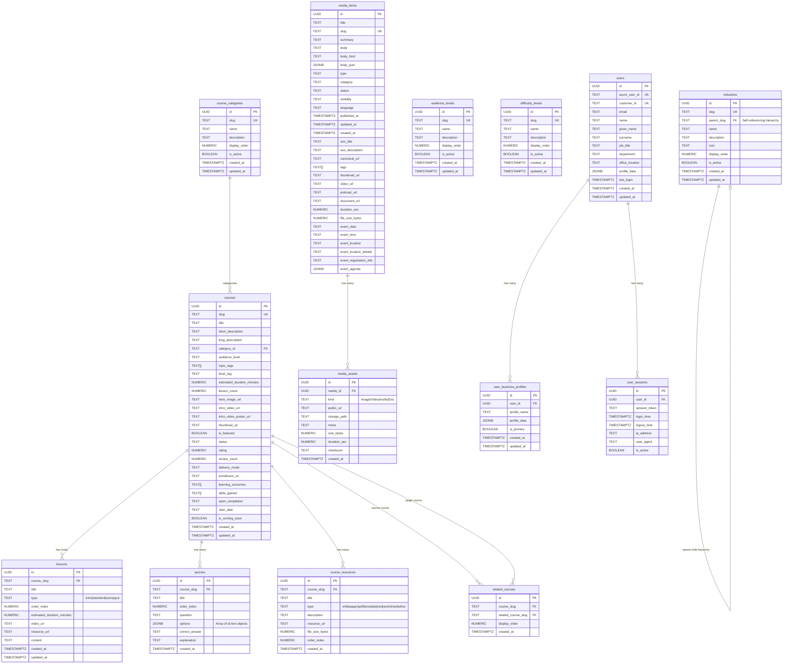
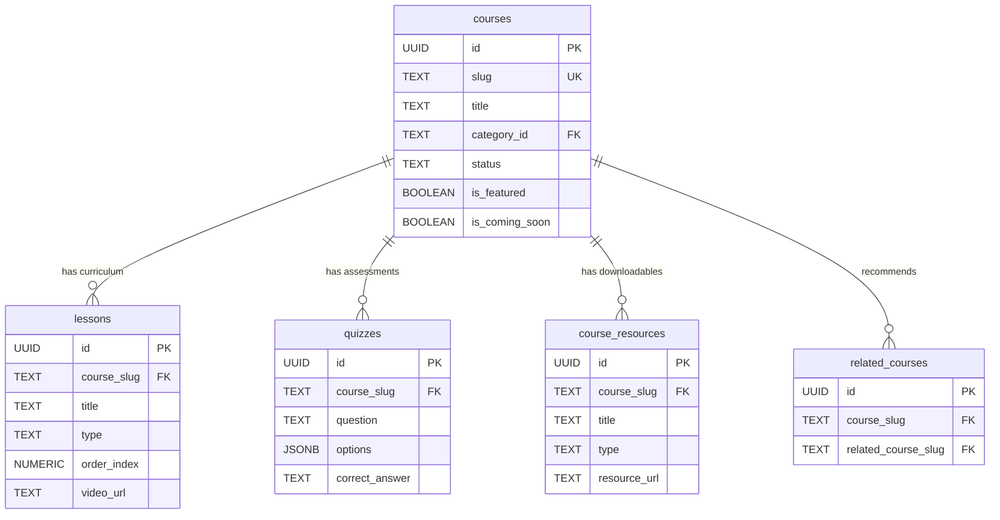
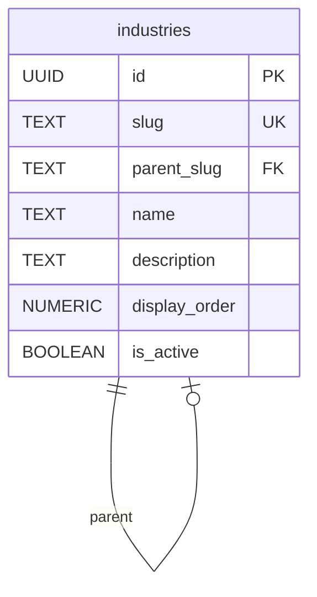
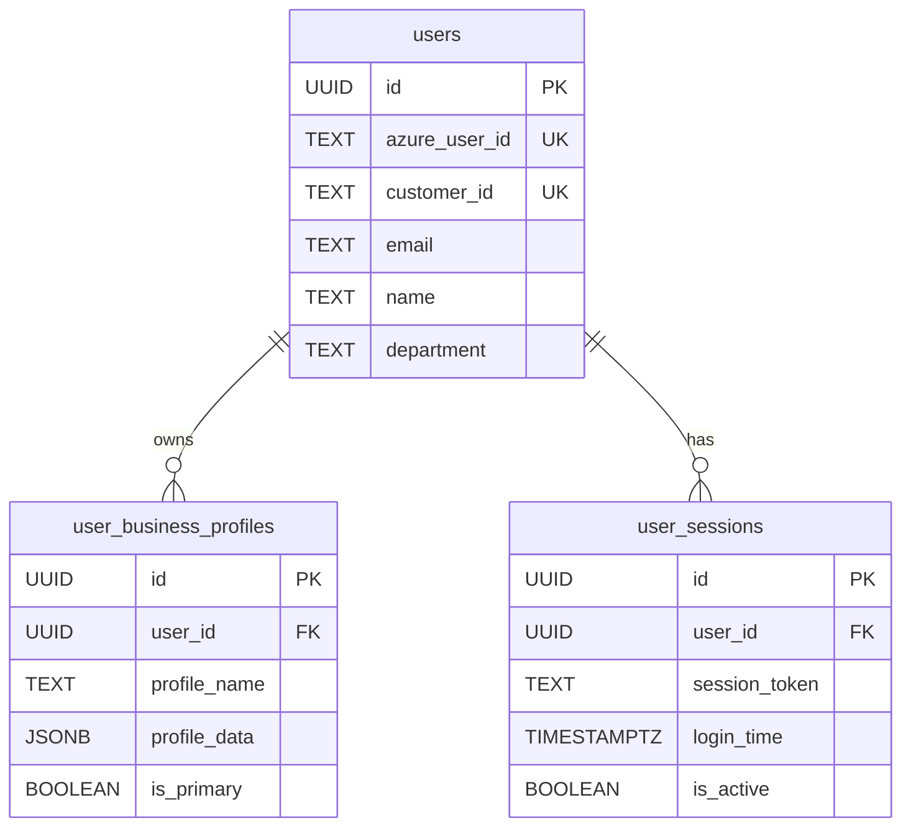

# DTMA Academy - Entity Relationship Diagram

This document provides the Entity Relationship Diagram (ERD) for the DTMA Academy platform database schema.

## Overview

The database is organized into the following domains:
- **Course Management**: Courses, Lessons, Quizzes, Resources
- **Content & Media**: Media Items, Media Assets
- **Classification**: Categories, Industries, Audience Levels, Difficulty Levels
- **User Management**: Users, Business Profiles, Sessions

---

## Complete ERD

---

## Domain-Specific Diagrams

### Course Management Domain

### Industry Hierarchy

### User Management Domain

---

## Key Relationships Summary

| Relationship | Cardinality | Description |
|:------------|:------------|:------------|
| `courses` → `lessons` | One-to-Many | A course contains multiple ordered lessons |
| `courses` → `quizzes` | One-to-Many | A course has multiple quiz questions |
| `courses` → `course_resources` | One-to-Many | A course has downloadable resources |
| `courses` → `related_courses` | Many-to-Many | Courses can recommend other courses |
| `course_categories` → `courses` | One-to-Many | Categories group courses |
| `industries` → `industries` | Self-referencing | Industries form a hierarchical tree |
| `media_items` → `media_assets` | One-to-Many | Media items have multiple asset files |
| `users` → `user_business_profiles` | One-to-Many | Users can have multiple business profiles |
| `users` → `user_sessions` | One-to-Many | Users have login session history |

---

## Foreign Key Constraints

| Table | Column | References | On Delete |
|:------|:-------|:-----------|:----------|
| `lessons` | `course_slug` | `courses(slug)` | CASCADE |
| `quizzes` | `course_slug` | `courses(slug)` | CASCADE |
| `course_resources` | `course_slug` | `courses(slug)` | CASCADE |
| `related_courses` | `course_slug` | `courses(slug)` | CASCADE |
| `related_courses` | `related_course_slug` | `courses(slug)` | CASCADE |
| `media_assets` | `media_id` | `media_items(id)` | CASCADE |
| `industries` | `parent_slug` | `industries(slug)` | SET NULL |
| `user_business_profiles` | `user_id` | `users(id)` | CASCADE |
| `user_sessions` | `user_id` | `users(id)` | CASCADE |
