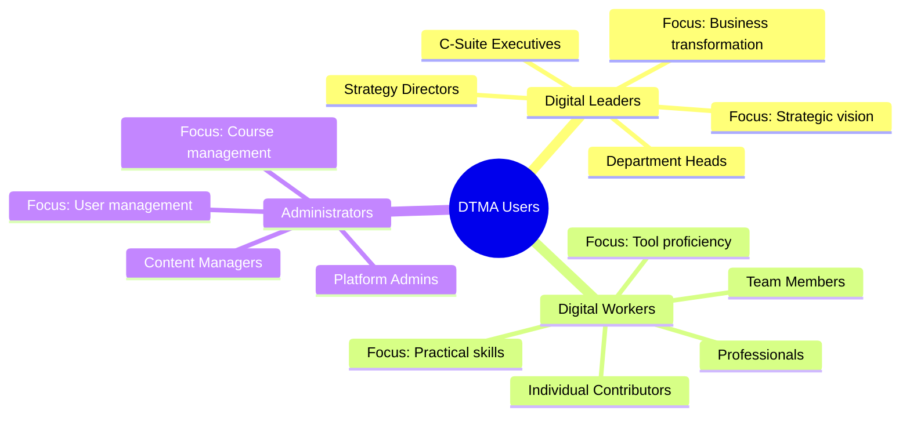
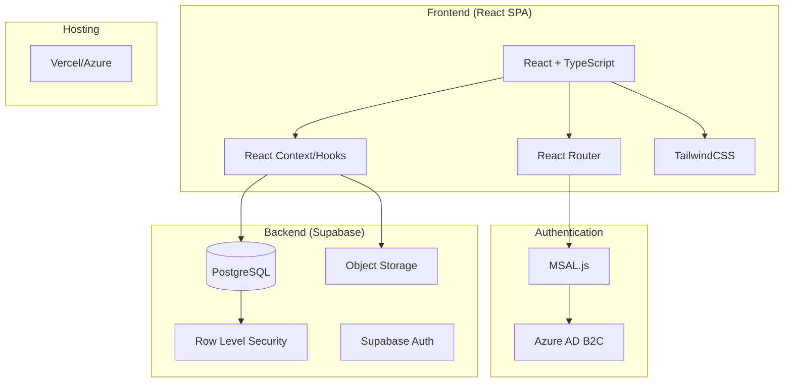
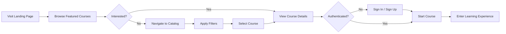
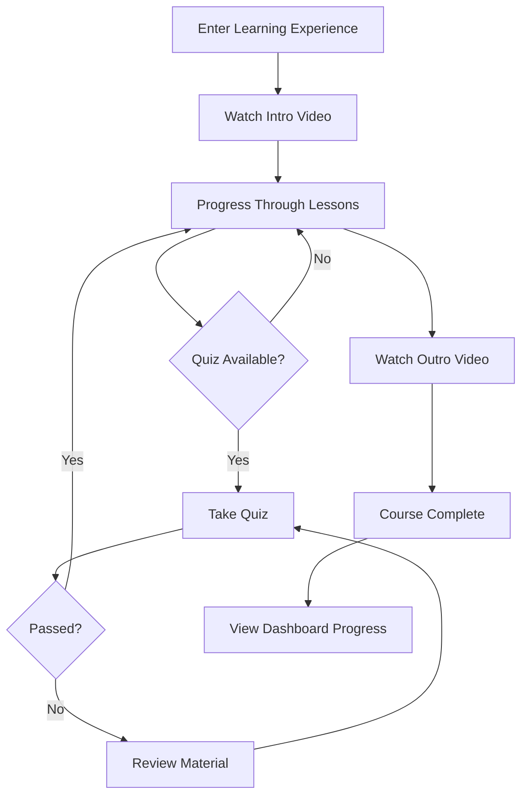
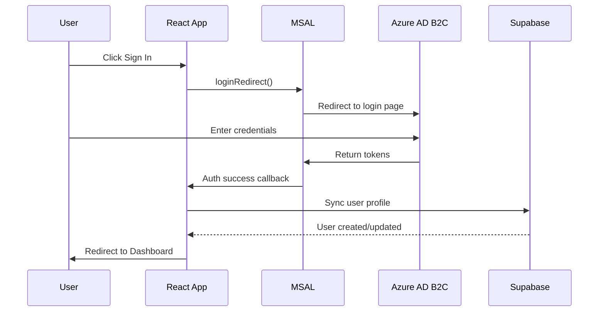

# DTMA Academy - Product Requirements Document (PRD)

**Version:** 1.0  
**Last Updated:** January 5, 2026  
**Status:** Active Development (MVP Phase)

---

## Table of Contents

1. [Executive Summary](#1-executive-summary)
2. [Product Vision & Goals](#2-product-vision--goals)
3. [Target Users](#3-target-users)
4. [Core Features](#4-core-features)
5. [Feature Specifications](#5-feature-specifications)
6. [Technical Architecture](#6-technical-architecture)
7. [User Journeys](#7-user-journeys)
8. [Data Model](#8-data-model)
9. [Authentication & Security](#9-authentication--security)
10. [API & Integrations](#10-api--integrations)
11. [Feature Flags & Configuration](#11-feature-flags--configuration)
12. [Roadmap](#12-roadmap)
13. [Success Metrics](#13-success-metrics)
14. [Risks & Assumptions](#14-risks--assumptions)
15. [Appendix](#15-appendix)

---

## 1. Executive Summary

**DTMA Academy** is a Learning Management System (LMS) platform designed to deliver digital transformation courses to professionals across the UAE. The platform operates as the learning backbone of the Digital Transformation and Manufacturing Academy initiative, serving courses aligned with the **6XD Dimensions of Digital**.

### Product Type
Web-based SPA (Single Page Application) learning platform

### Current Phase
MVP (Minimum Viable Product) - Course Marketplace & Learning Experience

### Business Model
Free access for MVP Phase; monetization strategy TBD for future phases

---

## 2. Product Vision & Goals

### Vision Statement
> Empower UAE professionals to become digital leaders by providing world-class, accessible digital transformation education through an intuitive learning platform.

### Strategic Goals

| Goal | Description | Success Measure |
|:-----|:------------|:----------------|
| **Accessibility** | Provide free, easy access to digital transformation courses | 100% of courses accessible without paywall |
| **Engagement** | Create an engaging learning experience with video content | >60% course completion rate |
| **Scale** | Support growing course catalog across 6XD dimensions | 50+ courses in Year 1 |
| **Authentication** | Enterprise-grade identity management | Azure AD B2C integration |

---

## 3. Target Users

### Primary Personas



### User Persona Details

#### 1. Digital Leaders
- **Role:** Senior executives and department heads
- **Goals:** Understand strategic implications of digital transformation
- **Needs:** High-level overviews, case studies, decision frameworks
- **Course Preference:** Shorter, concept-focused content
- **Time Availability:** Limited, prefers bite-sized learning

#### 2. Digital Workers
- **Role:** Professionals implementing digital initiatives
- **Goals:** Acquire practical skills for digital tools and processes
- **Needs:** Hands-on tutorials, step-by-step guides, assessments
- **Course Preference:** Detailed, skill-building content
- **Time Availability:** Moderate, willing to invest in skill development

#### 3. Platform Administrators
- **Role:** Internal team managing course content
- **Goals:** Maintain up-to-date course catalog, monitor engagement
- **Needs:** Content management tools, analytics dashboard
- **Access Level:** Admin privileges for course CRUD operations

---

## 4. Core Features

### MVP Feature Matrix

| Feature | Status | Route | Description |
|:--------|:------:|:------|:------------|
| **Landing Page** | ✅ Active | `/` | Hero section, featured courses, proof/trust elements |
| **Course Catalog** | ✅ Active | `/courses` | Browsable catalog with filters and search |
| **Course Details** | ✅ Active | `/courses/:itemId` | Full course page with tabs and resources |
| **Learning Experience** | ✅ Active | `/learning` | Video player and lesson navigation |
| **User Dashboard** | ✅ Active | `/dashboard/*` | Overview, profile, settings, support |
| **Authentication** | ✅ Active | — | Azure AD B2C via MSAL |
| **Admin Panel** | ✅ Active | `/admin/*` | Course content management |
| Growth Areas | ❌ Deferred | — | Growth areas marketplace |
| Other Marketplaces | ❌ Deferred | — | Financial, non-financial, knowledge hub |
| AI Chatbot | ❌ Deferred | — | Voiceflow KfBot integration |

---

## 5. Feature Specifications

### 5.1 Landing Page (`/`)

**Purpose:** Introduce DTMA Academy and drive course enrollment

**Components:**
| Component | Description |
|:----------|:------------|
| `HeroSection` | "Your Path to AI Skills" headline with CTA |
| `ProofAndTrust` | Statistics and testimonials |
| `D6 Categories` | 6XD dimension-based course segmentation |
| `FeaturedCourses` | Carousel of top/featured courses |
| `CallToAction` | Sign-up/Get Started flow |

**Acceptance Criteria:**
- [ ] Hero displays dynamic messaging based on user state (logged in vs anonymous)
- [ ] Featured courses carousel pulls from database (`is_featured = true`)
- [ ] CTA button behavior: Anonymous → Auth modal; Logged in → Dashboard/Continue

---

### 5.2 Course Catalog (`/courses`)

**Purpose:** Allow users to discover and browse available courses

**Components:**
| Component | Description |
|:----------|:------------|
| `FilterSidebar` | Category, industry, difficulty, audience level filters |
| `SearchBar` | Full-text course search |
| `CourseTile` / `MarketplaceCard` | Individual course display cards |
| `QuickViewModal` | Preview course without leaving catalog |

**Filter Taxonomy:**
```
├── Categories (6XD Dimensions)
├── Industries (Hierarchical: Parent → Sub-industry)
├── Audience Levels (Digital Leaders, Digital Workers)
├── Difficulty Levels (Beginner, Intermediate, Advanced)
└── Topics (Tags array)
```

**Acceptance Criteria:**
- [ ] Catalog loads all published courses (`status = 'published'`)
- [ ] Filters apply in real-time without page reload
- [ ] "Coming Soon" courses display with distinct visual treatment
- [ ] Search queries against title, description, and tags
- [ ] Mobile-responsive grid layout (1/2/3 columns)

---

### 5.3 Course Details (`/courses/:itemId`)

**Purpose:** Provide comprehensive course information for enrollment decision

**Layout:**
```
┌─────────────────────────────────────────────────────────┐
│  Hero Banner (title, category, audience, CTA)           │
├────────────────────────────────┬────────────────────────┤
│  Tab Navigation                │  Summary Card (sticky) │
│  ┌───────────────────────────┐ │  - Duration            │
│  │ About | Curriculum |      │ │  - Lesson Count        │
│  │ Outcomes | Resources      │ │  - Level               │
│  └───────────────────────────┘ │  - Enroll CTA          │
│                                │                        │
│  Tab Content Area              │                        │
│                                │                        │
├────────────────────────────────┴────────────────────────┤
│  Related Courses Section                                │
└─────────────────────────────────────────────────────────┘
```

**Tabs Content:**

| Tab | Content |
|:----|:--------|
| **About** | Long description, audience fit, prerequisites |
| **Curriculum** | Ordered lesson list with types and durations |
| **Outcomes** | Learning outcomes, skills gained, upon completion |
| **Resources** | Downloadable materials (PDFs, whitepapers, tools) |

**Acceptance Criteria:**
- [ ] Page loads course by `slug` parameter
- [ ] Curriculum displays lessons in `order_index` sequence
- [ ] Resources are downloadable with correct file URLs
- [ ] Related courses section shows 3 recommendations
- [ ] CTA states: "Start Course" (new) / "Resume Course" (in progress)

---

### 5.4 Learning Experience (`/learning`)

**Purpose:** Provide the in-course video learning interface

**Components:**
| Component | Description |
|:----------|:------------|
| `VideoPlayer` | Main video playback area |
| `LessonSidebar` | Ordered lesson list with completion status |
| `ProgressBar` | Course completion percentage |
| `QuizModule` | In-lesson assessments |

**Lesson Types:**
| Type | Description |
|:-----|:------------|
| `intro` | Course introduction video |
| `standard` | Regular lesson content (≤7 min recommended) |
| `outro` | Course conclusion/summary |
| `quiz` | Assessment questions |

**Acceptance Criteria:**
- [x] Video playback with standard controls (play, pause, seek, volume)
- [x] Lesson marked complete when video reaches final 60 seconds
- [x] Quiz questions load from `quizzes` table
- [x] Progress persists across sessions via `user_enrollments` and `lesson_progress` tables
- [x] Hybrid approach: localStorage for anonymous users, Supabase for authenticated
- [x] Mobile-responsive with collapsible sidebar

---

### 5.5 User Dashboard (`/dashboard/*`)

**Purpose:** Centralized hub for user's learning journey

**Sub-Routes:**

| Route | Page | Description |
|:------|:-----|:------------|
| `/dashboard/overview` | Overview | Learning progress, stats, active courses |
| `/dashboard/profile` | Profile | User profile management |
| `/dashboard/settings` | Settings | Account preferences |
| `/dashboard/support` | Support | Help and support interface |

**Acceptance Criteria:**
- [ ] Dashboard accessible only to authenticated users (Protected Route)
- [ ] Overview shows enrolled courses with progress percentages
- [ ] Profile displays data synced from Azure AD

---

### 5.6 Authentication

**Provider:** Azure AD B2C with MSAL (Microsoft Authentication Library)

**Flows:**
| Flow | Description |
|:-----|:------------|
| Sign In | Azure AD B2C login page redirect |
| Sign Up | Self-service registration via B2C |
| Sign Out | Token revocation and session clear |
| Silent Refresh | Background token refresh |

**User Sync:**
On successful authentication, user profile data is synchronized to Supabase `users` table:
- `azure_user_id` (unique identifier)
- `email`, `name`, `given_name`, `surname`
- `job_title`, `department`, `office_location`

---

## 6. Technical Architecture

### Stack Overview



### Technology Stack

| Layer | Technology | Purpose |
|:------|:-----------|:--------|
| **Frontend** | React 18 + TypeScript | UI Framework |
| **Routing** | React Router v6 | Client-side routing |
| **Styling** | TailwindCSS | Utility-first CSS |
| **Build** | Vite | Development & bundling |
| **Authentication** | MSAL.js + Azure AD B2C | Identity management |
| **Database** | Supabase (PostgreSQL) | Data persistence |
| **Storage** | Supabase Storage | Media files (videos, PDFs) |
| **Hosting** | Vercel / Azure | Deployment |

---

## 7. User Journeys

### Journey 1: Course Discovery & Enrollment



### Journey 2: Learning & Completion



---

## 8. Data Model

> See [entity_relationship_diagram.md](./entity_relationship_diagram.md) for the complete ERD.

### Core Entities Summary

| Entity | Purpose |
|:-------|:--------|
| `courses` | Main course catalog |
| `lessons` | Curriculum items within courses |
| `quizzes` | Assessment questions |
| `course_resources` | Downloadable materials |
| `related_courses` | Course recommendations |
| `course_categories` | 6XD dimension categorization |
| `industries` | Hierarchical industry taxonomy |
| `users` | Synced user profiles from Azure AD |
| `user_sessions` | Login session tracking |

---

## 9. Authentication & Security

### Authentication Flow



### Security Measures

| Measure | Implementation |
|:--------|:---------------|
| **Row Level Security (RLS)** | Supabase policies restrict data access |
| **HTTPS** | All traffic encrypted |
| **Token Refresh** | Silent token refresh via MSAL |
| **Protected Routes** | Dashboard routes require authentication |
| **Session Management** | User sessions tracked in `user_sessions` table |

---

## 10. API & Integrations

### Supabase Data Access

| Function | Description |
|:---------|:------------|
| `getCourses()` | Fetch all published courses |
| `getCourseBySlug(slug)` | Fetch single course by slug |
| `getLessonsByCourse(courseSlug)` | Fetch lessons for a course |
| `getQuizzesByCourse(courseSlug)` | Fetch quiz questions |
| `getResourcesByCourse(courseSlug)` | Fetch downloadable resources |

### External Integrations

| Integration | Status | Purpose |
|:------------|:------:|:--------|
| Azure AD B2C | ✅ Active | Identity provider |
| Supabase | ✅ Active | Database & storage |
| Voiceflow (KfBot) | ❌ Inactive | AI chatbot (deferred) |

---

## 11. Feature Flags & Configuration

### Feature Flag Configuration

**File:** `src/config/features.ts`

```typescript
export const FEATURES = {
  // Active Features
  COURSE_MARKETPLACE: true,
  LEARNING_EXPERIENCE: true,
  USER_DASHBOARD_CORE: true,
  ADMIN_COURSE_MANAGEMENT: true,
  AUTHENTICATION: true,
  
  // Deferred Features
  GROWTH_AREAS: false,
  OTHER_MARKETPLACES: false,
  ADVANCED_FORMS: false,
  AI_CHATBOT: false,
};
```

### Enabling Deferred Features

To enable a deferred feature:
1. Set flag to `true` in `features.ts`
2. Ensure corresponding routes are uncommented in `AppRouter.tsx`
3. Verify database tables/dependencies exist

---

## 12. Roadmap

### Phase 1: MVP (Current)
- [x] Course Catalog with filtering
- [x] Course Details pages
- [x] Learning Experience (video player)
- [x] Azure AD B2C authentication
- [x] User Dashboard (core)
- [x] Supabase database integration

### Phase 2: Engagement
- [ ] Course progress tracking (persistent)
- [ ] Quiz scoring and results
- [ ] Completion certificates
- [ ] Course ratings and reviews

### Phase 3: Growth
- [ ] Additional marketplaces re-activation
- [ ] AI Chatbot (Voiceflow)
- [ ] Advanced analytics dashboard
- [ ] Mobile app (React Native)

### Phase 4: Monetization
- [ ] Paid course tiers
- [ ] Subscription models
- [ ] Enterprise licensing

---

## 13. Success Metrics

### Key Performance Indicators (KPIs)

| Metric | Target | Measurement |
|:-------|:-------|:------------|
| **Course Starts** | 500/month | Users clicking "Start Course" |
| **Completion Rate** | >60% | Users finishing enrolled courses |
| **DAU/MAU Ratio** | >20% | Daily vs Monthly active users |
| **Session Duration** | >10 min | Average time in learning experience |
| **Catalog Browse Rate** | >3 courses/session | Courses viewed per visit |

---

## 14. Risks & Assumptions

### Assumptions
1. Azure AD B2C will remain the primary identity provider
2. Course content is provided by internal content team
3. Video hosting via Supabase Storage is sufficient for current scale
4. Free access model is acceptable for MVP launch

### Risks & Mitigations

| Risk | Impact | Mitigation |
|:-----|:-------|:-----------|
| Video storage costs | High | Monitor usage; plan CDN migration |
| User adoption | High | Marketing push; partner with enterprises |
| Content production | Medium | Establish content pipeline early |
| Azure AD outages | Medium | Implement offline-capable features |

---

## 15. Appendix

### A. File Structure Reference

```
src/
├── components/     # Reusable UI components
├── config/         # Feature flags, constants
├── contexts/       # React context providers
├── hooks/          # Custom React hooks
├── lib/            # Supabase client, utilities
├── pages/          # Route-level components
├── services/       # API and data access layer
├── types/          # TypeScript type definitions
└── utils/          # Helper functions
```

### B. Route Map

| Route | Component | Protected |
|:------|:----------|:---------:|
| `/` | `App` (Landing) | No |
| `/courses` | `CourseCatalogPage` | No |
| `/courses/:itemId` | `CourseDetailsPage` | No |
| `/learning` | `LearningScreen` | No* |
| `/dashboard/*` | `DashboardRouter` | Yes |
| `/admin/*` | Admin pages | Yes |
| `/coming-soon` | `ComingSoon` | No |

*Learning experience allows anonymous access but progress tracking requires auth.

### C. Related Documents

- [Entity Relationship Diagram](./entity_relationship_diagram.md)
- [Database Schema Documentation](../docs/database_schema.md)
- [Auth Configuration Pattern](../docs/auth-config-pattern.md)
- [MVP Scope Definition](../docs/mvp-scope.md)
